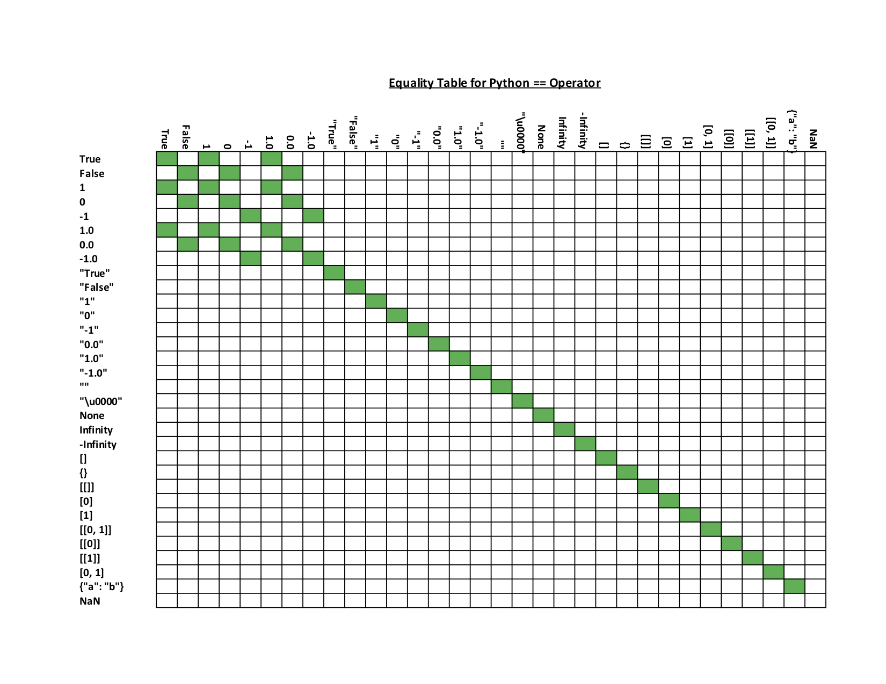
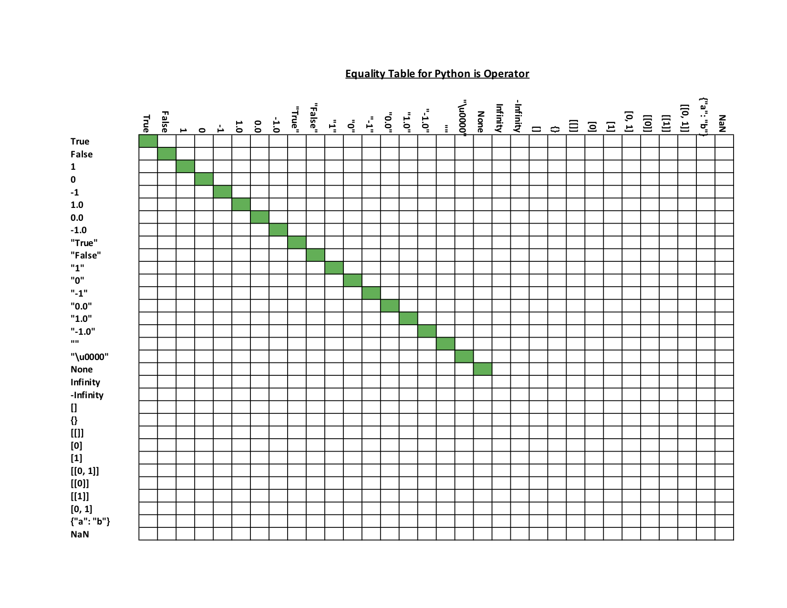

# Relational Operators

There are basically 2 categories of operators that are used to comparing values:

* **Equality operators** eg. `==`, `!=`
* **Ordering operators** eg. `>`, `>=`, `<`, `<=`

## Equality

Equality can be generally defined as:

* **Physical equality** - if two references reference the same object.
* **Structural equality** - if the two objects have the same representation ie. same contents.

The following table is taken from [Wikipedia: Relational operator](https://en.wikipedia.org/wiki/Relational_operator), which summarizes the different mechanisms to test for the physical and structural equality in various languages.

| Language    | Structural Equality      | Physical Equality     |
|-------------|--------------------------|-----------------------|
| Go          | reflect.DeepEqual(a, b)  | &a == &b              |
|             | a == b                   |                       |
| Java        | a.equals(b)              | a == b                |
| Javascript  | a == b                   | a === b               |
| Python      | a == b                   | a is b                |

## Python

**Notes**

* Operands to be compared don't need to be the same type
* All comparison operations in Python have the same priority
* According to the [official Python documentation](https://docs.python.org/3.7/reference/expressions.html#comparisons): "unlike C, expressions like a < b < c have the interpretation that is conventional in mathematics"

```python
a == b
a is b
a is not b
# Yes, we can do this in Python (read below). a < b and b < c isn't necessary
a < b < c
(a == b) and (c == d)
(a == b) or (c == d)
not a
```

### is vs ==

The `is` operator is used in identity comparison, whereas `==` is used in equality comparison. When two operands have the same identity, they are the same object. This means that the operands are referenced by the same memory location. On the other hand, the `==` operator is an equality operator for comparing the values of the 2 operands.

Here are the tables of how Python evaluates the different operands under operators `==` and `is`.




