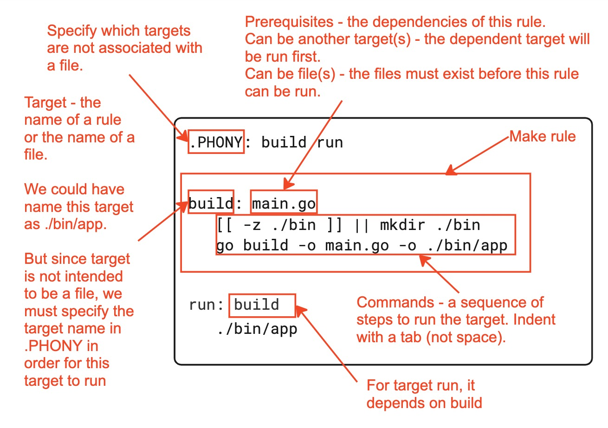

# Makefile in a Nutshell

## Basic Syntax

The following diagram should explain the basic syntax of a Makefile.



## Variables

### Wildcard

Use it this way to match files. For example:

```makefile
# Wrong. Always use it with the function wildcard so that the wildcard gets expanded
build: *.go

# Correct: Use the wildcard function.
build: $(wildcard *.go)
```

### Assignments

For `=` and `:=`, it's best explained with this example.

```makefile
# := immediately expands the variable and look for the person variable. But since the latter
# isn't defined during assignment, the variable is assigned with "hello ".
hello_expand_at_assignment := "hello ${person}"
# = the variable expands when it is used. Since person is defined when it is first used, we
# get "hello sam"
hello_expand_when_used = "hello ${person}"
person = "sam"

.PHONY: echo-name
echo-name:
	@echo $(hello_expand_at_assignment)
	@echo $(hello_expand_when_used)
```


## Commands

### Silencing

Here's a Makefile:

```makefile
build:
    echo "Building project..."
    echo "Starting with src directory..."
```

When the target ie. `make build` is run, the following will be printed:

```
echo "Building project..."
Building project...
echo "Starting with src directory..."
Starting with src directory...
```

If add `@` before a command, the command will not be printed.

```makefile
build:
    @echo "Building project..."
    @echo "Starting with src directory..."
```

## Reference

* [Makefile Tutorial](https://makefiletutorial.com/#flavors-and-modification)
